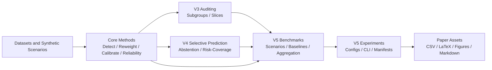
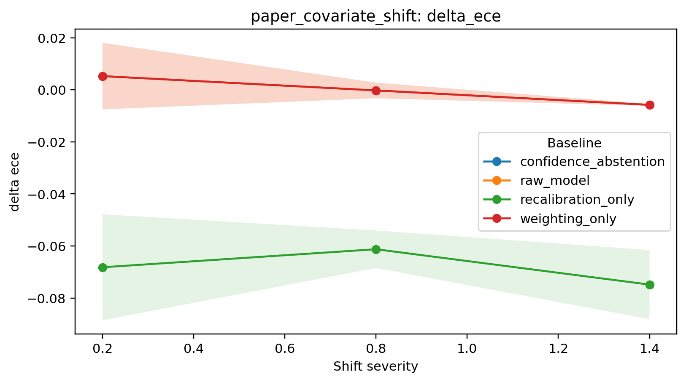
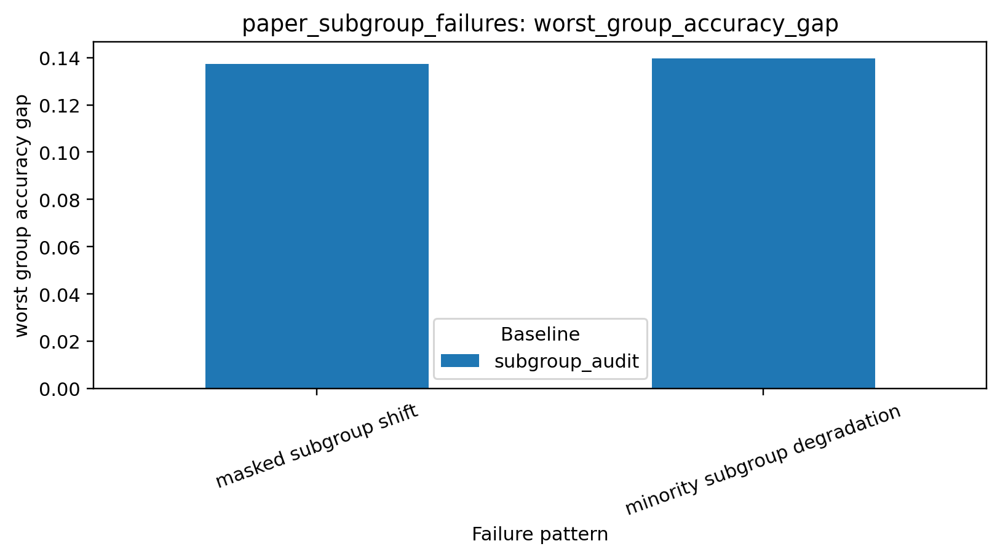

# ShiftStat

ShiftStat is an open-source scientific Python library for studying predictive reliability under tabular distribution shift.

V5 turns the project into a publication-grade benchmark and experiment platform: alongside detection, weighting, calibration, subgroup auditing, and selective prediction, the library now supports repeated-seed benchmark scenarios, config-driven experiment execution, and paper-ready artifact generation.

## Why ShiftStat

Aggregate metrics can remain deceptively stable while calibration, subgroup reliability, or accepted-set risk fails under deployment shift. ShiftStat is built for the scientific question behind those failures:

When the deployment distribution changes, which metrics drift, which slices fail first, and which operational responses actually help?

## Key capabilities

- Shift detection for mixed-type tabular data
- Importance weighting and recalibration under covariate shift
- Reliability profiles and deployment reports
- Subgroup-aware auditing and interpretable failure-slice discovery
- Selective prediction, abstention policies, and risk-coverage analysis
- Reproducible benchmark scenarios with repeated-seed aggregation
- JSON/YAML experiment manifests with logs, manifests, and artifact directories
- CSV, markdown, LaTeX, and figure exports for preprints and software papers

## Installation

```bash
pip install shiftstat
```

For development:

```bash
pip install -e .[dev,docs,examples]
```

## Minimal V5 benchmark example

```python
from shiftstat.bench import BenchmarkRunner, make_covariate_shift_sweep_scenario

scenario = make_covariate_shift_sweep_scenario(
    severities=[0.2, 0.8, 1.4],
    seeds=[7, 19, 43],
    baseline_names=[
        "raw_model",
        "weighting_only",
        "recalibration_only",
        "confidence_abstention",
    ],
)

result = BenchmarkRunner().run(scenario)
paths = result.export_artifacts("paper_assets/generated/covariate_shift_demo")

print(result.aggregate_frame())
print(paths["figures"])
```

## Config-driven experiments

```bash
shiftstat-experiment paper_assets/configs/publication_suite.yaml
```

This produces:

- run-level CSVs
- aggregated benchmark summaries
- markdown reports
- LaTeX-ready tables
- figure files
- experiment manifests and logs

## Architecture



## Example benchmark artifacts

Covariate-shift calibration sweep:



Hidden subgroup failure gap:



## Documentation

Documentation lives in [docs/](docs/index.md) and includes:

- methodological guides for subgroup auditing and selective prediction
- V5 guides for benchmarking, experiment configuration, reproducibility, and publication workflows
- API reference pages for `bench` and `experiments`
- runnable examples and case studies

## Paper assets

The repository now includes reproducible configs and generated benchmark outputs in [paper_assets/](paper_assets/README.md). The artifact map is documented in [paper_assets/inventory.md](paper_assets/inventory.md).

## Status

ShiftStat V5 adds a serious benchmark and experiment layer while keeping the project focused on statistical reliability under shift rather than generic MLOps. Multiclass benchmarking, uncertainty intervals, and richer appendix automation remain intentionally deferred.
