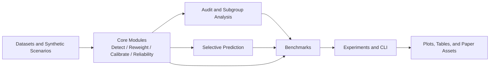

<div align="center">
  <h1>ShiftStat</h1>
  <p><strong>Scientific Python tooling for reliability under tabular distribution shift</strong></p>
  <p>Detection, weighting, recalibration, subgroup auditing, selective prediction, and reproducible benchmark workflows for tabular ML systems.</p>
  <p>
    <a href="#quickstart">Quickstart</a> |
    <a href="docs/index.md">Documentation</a> |
    <a href="docs/examples.md">Examples</a> |
    <a href="paper_assets/README.md">Paper Assets</a> |
    <a href="CONTRIBUTING.md">Contributing</a>
  </p>
</div>

<p align="center">
  
  
</p>

> Aggregate metrics can stay stable while calibration, subgroup reliability, or accepted-set risk quietly fails after deployment shift. ShiftStat is built to make those failures visible, compare interventions, and export reproducible evidence.

## Certified worst-group audits under covariate shift

ShiftStat now includes the inferential workflow behind the accompanying paper:
local certification of worst-group reliability alarms under covariate shift. The
key distinction is between a subgroup-bin gap that merely looks large and an
alarm that is locally supported by enough weighted labels to be actionable.

```python
from shiftstat.certification import CertifiedWorstGroupAuditor
from shiftstat.reweight import CrossFittedImportanceWeighter

weights = CrossFittedImportanceWeighter(method="logistic", n_folds=5).fit_predict(
    X_source,
    X_target,
)

report = CertifiedWorstGroupAuditor(
    n_bins=6,
    tolerance=0.12,
    alpha=0.10,
).fit(
    y_source=y_source,
    scores_source=scores_source,
    scores_target=scores_target,
    weights=weights,
    groups=source_groups,
    target_groups=target_groups,
).report()

print(report.certified_failures())
print(report.insufficient_evidence())
```

The certified report includes local ESS, simultaneous confidence radii,
learned-weight sensitivity, certified excess, and explicit decisions:
`certified_failure`, `insufficient_evidence`, `no_detected_failure`, or
`out_of_scope`.

## At a glance

| Item | Details |
| --- | --- |
| Package | `shiftstat` |
| Version | `0.6.0` |
| Python | `>=3.10` |
| Focus | Scientific evaluation of predictive reliability under tabular distribution shift |
| Includes | Core diagnostics, high-level workflows, benchmark scenarios, config-driven experiments, plots, and publication-ready artifacts |
| Install | `pip install shiftstat` |

## What ShiftStat covers

| Scientific layer | What it helps answer | Main entry points |
| --- | --- | --- |
| Shift detection | Did the target distribution move, and which features changed most? | `ShiftDetector`, `shiftstat.detect`, `shiftstat.plotting` |
| Reweighting and recalibration | Can we correct for covariate shift or recalibrate scores? | `ImportanceWeighter`, `CalibrationEvaluator`, `TemperatureScaler` |
| Reliability workflows | How do reference and target reliability compare end to end? | `evaluate_under_shift`, `ReliabilityAnalyzer` |
| Subgroup auditing | Which operational slices degrade first, and are failures concentrated? | `SubgroupAnalyzer`, `ReliabilityAuditor`, `SliceDiscoverer` |
| Selective prediction | Does abstention improve accepted-set risk under shift? | `evaluate_selective_under_shift`, `SelectivePredictor`, `AbstentionPolicy` |
| Benchmarks and experiments | Which interventions help across scenarios, seeds, and benchmark families? | `BenchmarkRunner`, `BenchmarkScenario`, `run_experiment`, `shiftstat-experiment` |
| Reporting and artifacts | How do we export tables, figures, markdown summaries, and manifests? | `BenchmarkResult.export_artifacts(...)`, `paper_assets/`, `shiftstat.plotting` |

## Quickstart

### 1. Evaluate selective deployment under shift

```python
from sklearn.linear_model import LogisticRegression

from shiftstat.datasets import make_covariate_shift_classification
from shiftstat.selective import evaluate_selective_under_shift

bundle = make_covariate_shift_classification(random_state=3)

result = evaluate_selective_under_shift(
    LogisticRegression(max_iter=2000),
    bundle.X_ref,
    bundle.y_ref,
    bundle.X_target,
    bundle.y_target,
    apply_importance_weighting=True,
    use_weighted_threshold_tuning=True,
    target_coverage=0.8,
    random_state=3,
)

print(result.summary_frame())
print(result.to_report().to_markdown())
```

### 2. Run a repeated-seed benchmark from Python

```python
from shiftstat.bench import BenchmarkRunner, make_covariate_shift_sweep_scenario

scenario = make_covariate_shift_sweep_scenario(
    severities=[0.2, 0.8, 1.4],
    seeds=[7, 19, 43],
    baseline_names=[
        "raw_model",
        "weighting_only",
        "recalibration_only",
        "confidence_abstention",
    ],
)

result = BenchmarkRunner().run(scenario)
artifacts = result.export_artifacts("paper_assets/generated/covariate_shift_demo")

print(result.aggregate_frame())
print(artifacts["figures"])
```

### 3. Run a config-driven experiment

```bash
shiftstat-experiment paper_assets/configs/publication_suite.yaml
```

This writes ordinary files that can be inspected, versioned, and cited:

- per-scenario run CSVs
- aggregated summary CSVs
- markdown summaries
- LaTeX tables
- figure files
- manifests, copied configs, and run logs

## How the project fits together



## Repository map

| Path | What lives there |
| --- | --- |
| [src/shiftstat](src/shiftstat) | Typed library code for detection, metrics, reweighting, calibration, reliability, subgroup analysis, selective prediction, benchmarks, experiments, plotting, and reports |
| [docs](docs/index.md) | MkDocs documentation, theory notes, workflow guides, API reference, and case-study material |
| [examples](examples) | Runnable scripts covering drift detection, weighting, recalibration, subgroup failures, selective deployment, benchmarks, and paper artifact generation |
| [benchmarks](benchmarks) | Benchmark runners plus JSON and YAML configs for benchmark suites |
| [paper_assets](paper_assets/README.md) | Reproducible experiment configs, generated tables and figures, and an artifact inventory |
| [tests](tests) | Regression suite spanning the V1-V5 feature layers |

## Where to go next

| If you want to... | Start here |
| --- | --- |
| Install and get moving | [docs/installation.md](docs/installation.md) and [docs/quickstart.md](docs/quickstart.md) |
| Understand the scientific motivation | [docs/theory.md](docs/theory.md) and [docs/reliability_theory.md](docs/reliability_theory.md) |
| Audit hidden subgroup failures | [docs/subgroup.md](docs/subgroup.md), [docs/audit.md](docs/audit.md), and [examples/discover_failure_slices.py](examples/discover_failure_slices.py) |
| Study abstention and risk-coverage tradeoffs | [docs/selective_prediction.md](docs/selective_prediction.md), [docs/risk_coverage.md](docs/risk_coverage.md), and [examples/abstention_under_shift.py](examples/abstention_under_shift.py) |
| Run repeated-seed benchmarks | [docs/benchmarking.md](docs/benchmarking.md) and [examples/benchmark_covariate_sweep.py](examples/benchmark_covariate_sweep.py) |
| Use config-driven experiments | [docs/experiment_configuration.md](docs/experiment_configuration.md) and [paper_assets/configs](paper_assets/configs) |
| Build figures and tables for a paper | [docs/paper_artifacts.md](docs/paper_artifacts.md), [docs/publication_workflow.md](docs/publication_workflow.md), and [paper_assets/inventory.md](paper_assets/inventory.md) |
| Contribute to the codebase | [CONTRIBUTING.md](CONTRIBUTING.md), [CODE_OF_CONDUCT.md](CODE_OF_CONDUCT.md), and [mkdocs.yml](mkdocs.yml) |

## Development

```bash
pip install -e .[dev,docs,examples]
pytest -m "not slow"
pytest --cov=shiftstat --cov-report=term-missing
ruff check .
mypy src
mkdocs build
```

On Windows PowerShell, activate a virtual environment with:

```powershell
python -m venv .venv
.venv\Scripts\Activate.ps1
pip install -e .[dev,docs,examples]
```

Slow example and benchmark checks are marked with `examples`, `benchmark`, and
`slow`; the full CI suite also builds the wheel, smoke-installs it, and checks
the documentation. Release steps are documented in [RELEASE.md](RELEASE.md) and
[docs/release_process.md](docs/release_process.md).

## Project status

ShiftStat `0.6.0` adds certified worst-group auditing under covariate shift on top of the earlier detection, weighting, calibration, subgroup-auditing, selective-prediction, and benchmark layers.

Multiclass certification, sharper complexity penalties for very large adaptive subgroup classes, and richer appendix automation are intentionally still deferred.

## Citation and license

ShiftStat is released under the BSD 3-Clause License. If you use it in scientific work, please cite the software record in [CITATION.cff](CITATION.cff). Release history lives in [CHANGELOG.md](CHANGELOG.md).
